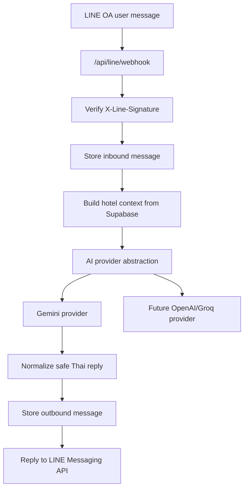

# แผน implement LINE OA AI Concierge MVP

เป้าหมายคือ ship ให้เร็วที่สุดแบบเห็น product จริง: ลูกค้าทัก LINE OA แล้ว AI ตอบข้อมูลโรงแรม เช็กห้องว่าง/ราคาเบื้องต้นจาก Supabase และพาไปจองผ่าน flow เดิมของเว็บ โดยยังไม่ทำ admin UI สำหรับตั้งค่า, inbox, rich menu หรือ AI สร้าง booking จริงทันที

## หลักคิด

- ใช้ระบบเดิมให้มากที่สุด: room types, rooms, bookings, payments, PromptPay config, public `/booking`
- ทำ backend-only ก่อน เพื่อให้ต่อ LINE OA แล้วใช้งานได้เร็ว
- แยก AI provider ตั้งแต่แรก เพื่อเริ่มด้วย Gemini free tier และเปลี่ยนเป็น OpenAI/Groq ได้ภายหลัง
- ไม่ให้ AI เป็นแหล่ง truth สำหรับราคา ห้องว่าง หรือ booking status ต้อง query Supabase ก่อนตอบเสมอ
- ระยะแรกให้ AI ปิดการขายด้วยลิงก์จอง ไม่สร้าง confirmed booking เอง

## MVP ที่จะได้

ลูกค้าสามารถถามใน LINE ได้ เช่น:

- มีห้องว่างวันที่ 1-2 มิ.ย. สำหรับ 2 คนไหม
- ห้องพักราคาเท่าไหร่
- มีห้องแบบไหนบ้าง
- อยู่ที่ไหน ติดต่อยังไง
- จองยังไง
- มีโปรไหม

ระบบจะตอบตามภาษาที่ลูกค้าถาม กระชับ และถ้าต้องจองจะส่งลิงก์ไปหน้า `/booking` พร้อมสรุปข้อมูลที่ลูกค้าถามมา

## สิ่งที่ยังไม่ทำในรอบแรก

- หน้า admin setting สำหรับ bot
- หน้า admin inbox
- human takeover UI
- rich menu
- AI สร้าง booking จริงทันที
- ตรวจสลิป/OCR ผ่าน LINE
- ระบบ RAG/file search เต็มรูปแบบ
- workflow refund/cancel แบบอัตโนมัติ

## Architecture



## ไฟล์ที่จะเพิ่ม

### LINE layer

- `src/app/api/line/webhook/route.ts`
  - รับ webhook จาก LINE
  - อ่าน raw body เพื่อ verify signature
  - parse events
  - รองรับ text message ก่อน
  - เรียก AI concierge แล้ว reply กลับ LINE

- `src/lib/line/signature.ts`
  - verify `X-Line-Signature` ด้วย HMAC-SHA256
  - แยกออกมาเพื่อ test ง่าย

- `src/lib/line/client.ts`
  - `replyLineMessage(replyToken, messages)`
  - รวม LINE Messaging API access token และ error handling

### AI layer

- `src/lib/ai/provider.ts`
  - interface กลาง เช่น `AiProvider`, `AiGenerateInput`, `AiGenerateResult`
  - factory อ่าน `AI_PROVIDER`

- `src/lib/ai/providers/gemini.ts`
  - provider แรกสำหรับเริ่มฟรี/ถูก
  - ใช้ `GEMINI_API_KEY`, `GEMINI_MODEL`

- `src/lib/ai/line-concierge.ts`
  - system prompt
  - intent hints
  - guardrails
  - เรียก hotel context
  - normalize คำตอบสุดท้ายก่อนส่ง LINE

- `src/lib/ai/hotel-context.ts`
  - query hotel, contacts, room types, promotions
  - query availability จาก `rooms` และ `bookings`
  - สร้าง context สั้น ๆ ให้ AI

### Types/constants

- `src/types/line-ai.types.ts`
  - type สำหรับ LINE event, AI intent, AI result, hotel context

- `src/constants/line-ai.ts`
  - provider names
  - model defaults
  - max input/output lengths
  - fallback messages
  - supported LINE event types

### Database

- `migrations/add_line_ai_mvp.sql`
  - เพิ่ม `line_users`
  - เพิ่ม `line_conversations`
  - เพิ่ม `line_messages`
  - ใส่ indexes สำหรับ `hotel_id`, `line_user_id`, `created_at`

## Database schema รอบแรก

```sql
CREATE TABLE IF NOT EXISTS line_users (
  id UUID PRIMARY KEY DEFAULT gen_random_uuid(),
  hotel_id UUID NOT NULL REFERENCES hotels(id) ON DELETE CASCADE,
  line_user_id TEXT NOT NULL,
  display_name TEXT,
  customer_id UUID REFERENCES customers(id) ON DELETE SET NULL,
  created_at TIMESTAMPTZ NOT NULL DEFAULT NOW(),
  updated_at TIMESTAMPTZ NOT NULL DEFAULT NOW(),
  UNIQUE (hotel_id, line_user_id)
);

CREATE TABLE IF NOT EXISTS line_conversations (
  id UUID PRIMARY KEY DEFAULT gen_random_uuid(),
  hotel_id UUID NOT NULL REFERENCES hotels(id) ON DELETE CASCADE,
  line_user_id TEXT NOT NULL,
  status TEXT NOT NULL DEFAULT 'open',
  last_intent TEXT,
  last_message_at TIMESTAMPTZ,
  metadata JSONB NOT NULL DEFAULT '{}'::jsonb,
  created_at TIMESTAMPTZ NOT NULL DEFAULT NOW(),
  updated_at TIMESTAMPTZ NOT NULL DEFAULT NOW()
);

CREATE TABLE IF NOT EXISTS line_messages (
  id UUID PRIMARY KEY DEFAULT gen_random_uuid(),
  hotel_id UUID NOT NULL REFERENCES hotels(id) ON DELETE CASCADE,
  line_user_id TEXT,
  conversation_id UUID REFERENCES line_conversations(id) ON DELETE SET NULL,
  direction TEXT NOT NULL,
  message_type TEXT NOT NULL DEFAULT 'text',
  line_message_id TEXT,
  text TEXT,
  ai_provider TEXT,
  ai_model TEXT,
  metadata JSONB NOT NULL DEFAULT '{}'::jsonb,
  created_at TIMESTAMPTZ NOT NULL DEFAULT NOW()
);
```

## Environment variables

```bash
LINE_CHANNEL_SECRET=
LINE_CHANNEL_ACCESS_TOKEN=
LINE_BOT_ENABLED=true

AI_PROVIDER=gemini
GEMINI_API_KEY=

NEXT_PUBLIC_SITE_URL=https://your-domain.com
```

อนาคตเพิ่มได้:

```bash
OPENAI_API_KEY=
OPENAI_MODEL=
GROQ_API_KEY=
GROQ_MODEL=
```

## AI behavior

AI ต้องตอบแบบนี้:

- ภาษาไทย สุภาพ กระชับ เหมาะกับโรงแรม/ที่พัก
- ถามต่อครั้งละ 1 คำถามเมื่อข้อมูลจองไม่ครบ
- ถ้าถาม availability ต้องใช้ผล query จากระบบเท่านั้น
- ถ้าถามราคา exact total ให้ส่งไปหน้า booking หรือใช้ pricing server path เดิม
- ถ้าข้อมูลไม่ชัด ให้บอกว่าจะให้แอดมินช่วยดูต่อ
- ห้ามแต่งข้อมูลเอง เช่น โปร, เลขบัญชี, refund policy, ห้องว่าง, ยอดชำระ

## Phase 1: ต่อ LINE แล้วตอบได้

เป้าหมาย: LINE OA ส่งข้อความเข้าเว็บและได้รับคำตอบ AI กลับ

งาน:

1. เพิ่ม migration logging tables
2. เพิ่ม LINE signature verifier
3. เพิ่ม LINE reply client
4. เพิ่ม webhook route
5. เพิ่ม Gemini provider
6. เพิ่ม concierge prompt แบบใช้ hotel summary เบื้องต้น
7. log inbound/outbound messages

ผลลัพธ์:

- LINE Developers Console กด Verify webhook ผ่าน
- ลูกค้าพิมพ์ข้อความแล้วได้คำตอบภาษาไทย
- ถ้า AI/provider ล่ม ระบบตอบ fallback สุภาพ

## Phase 2: ตอบจากข้อมูลจริง

เป้าหมาย: AI ตอบข้อมูลโรงแรม ห้อง ราคาเริ่มต้น โปร และห้องว่างจาก Supabase

งาน:

1. `hotel-context.ts` ดึง hotel active ตัวแรกหรือจาก config ที่ระบุ
2. ดึง contacts จาก `cms_hotel_contacts`
3. ดึง room types, active rooms, cover image แบบสั้น
4. ดึง promotions ที่ active
5. ทำ availability query:
   - ห้อง active
   - exclude bookings statuses `pending`, `confirmed`, `checked_in`
   - overlap: `check_in_date < requested_check_out` และ `check_out_date > requested_check_in`
6. ให้ AI ใช้ context นี้ตอบ

ผลลัพธ์:

- ถาม “มีห้องว่างไหม” แล้วระบบตอบจาก DB
- ถาม “ราคาเท่าไหร่” แล้วตอบ starting price หรือส่งไปหน้า booking สำหรับยอดรวม

## Phase 3: Booking lead แบบเร็ว

เป้าหมาย: AI ช่วยรวบรวมข้อมูลก่อนพาไปจอง

ข้อมูลที่เก็บ:

- check-in
- check-out
- guests
- room type preference
- name
- phone

งาน:

1. เพิ่ม metadata ใน `line_conversations`
2. AI ถามข้อมูลที่ขาดทีละข้อ
3. เมื่อข้อมูลพอ ให้ส่งลิงก์ `/booking`
4. ถ้าทำได้ง่าย ค่อยเพิ่ม query params เช่น:

```text
/booking?checkIn=2026-06-01&checkOut=2026-06-02&guests=2
```

ผลลัพธ์:

- ลูกค้าไม่ต้องเริ่มใหม่ในเว็บทั้งหมด
- ยังใช้ booking flow เดิมที่ปลอดภัยกว่า

## Phase 4: Hardening หลัง ship

ทำหลัง MVP ใช้งานได้แล้ว:

- Rate limit ตาม `line_user_id`
- จำกัดข้อความยาวเกิน
- เพิ่ม retry/backoff สำหรับ LINE reply
- เพิ่ม provider fallback เช่น Gemini ล่มแล้วใช้ Groq
- เพิ่ม alert เมื่อ AI fallback บ่อย
- เพิ่ม admin inbox หรือ handoff UI
- เพิ่ม booking draft table ถ้าต้องการให้แอดมินกด confirm จากหลังบ้าน

## Acceptance criteria

- Webhook verify ใน LINE Developers Console ผ่าน
- Invalid LINE signature ได้ `401`
- Text event ได้ response กลับ LINE
- Non-text event ไม่ทำให้ route error
- ถาม availability แล้ว query DB จริง
- ถาม booking แล้วระบบส่งลิงก์ `/booking`
- ไม่มี secret หลุด client-side
- TypeScript ไม่มี `any`
- Build ผ่าน

## Verification commands

```bash
npx tsc --noEmit
npx eslint src/app/api/line/webhook/route.ts src/lib/line src/lib/ai src/types/line-ai.types.ts
npm test
npm run build
```

## ความเสี่ยง

- Free tier ของ AI provider มี limit และอาจไม่นิ่งพอใน production
- Gemini free tier อาจมี policy เรื่องใช้ข้อมูลเพื่อปรับปรุง product จึงไม่ควรส่งข้อมูลอ่อนไหวเกินจำเป็น
- ถ้าตอบ availability โดยไม่ query DB ทุกครั้ง อาจทำให้ลูกค้าเข้าใจผิด
- ถ้าให้ AI สร้าง booking จริงเร็วเกินไป จะเสี่ยง duplicate booking และราคาไม่ตรง
- LINE webhook ต้องใช้ public HTTPS URL จึงต้อง deploy หรือใช้ tunnel สำหรับ test local
